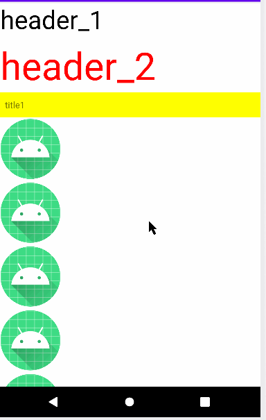

## RecyclerExpanableAdapter

效果图 

二级的RecyclerView的adapter继承BaseRecyclerExpandableAdpter实现，滑动之后将title固定在顶部使用FloatItemDecoration实现<br/<>
原理请看这两个类的源码，已经写得很清楚了 

由于这是一个library，所以我不方便将示例代码写在这里，具体到app module找一下示例代码