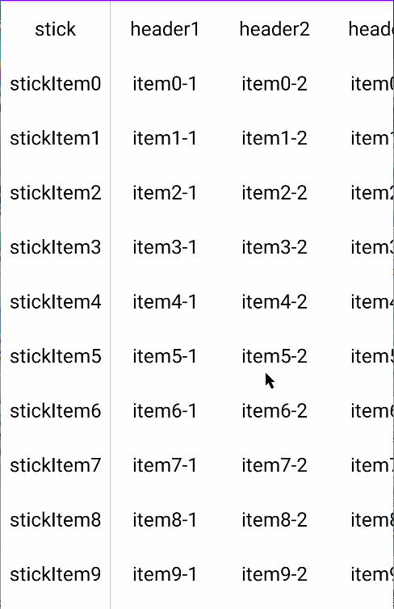

效果图： 

实现思路可以看[这篇文章](https://blog.csdn.net/android_upl/article/details/130190475)，这里我就不重复赘述。 
<b>GestureLaout：</b>借助VelocityTacker和Scroller实现松开手指后惯性滑动的功能。Scroller本身不具备滑动的功能，最终实现还是需要用到View的scrollTo/ScrollBy方法。在这个过程中，需要借助View的computeScroll方法来一直调用scrollTo/scrollBy方法让View滚动起来。 
<b>ScrollManager：</b>到了RecyclerView层面，就需要用一个Manager来控制所有item。所以GestureLayout就通过interface将touch操作暴露出去，让ScrollManager来统一调用所有的item进行滚动。而ScrollManager是怎么添加和移除item？是使用View的attch方法和detach方法。当View&nbsp;attch时，添加到Manager里面。detach时，从Manager移除。这样就保证了Manager里面不会存在多余的item。 
<b>header：</b>直接在RecylerView上面放一个header&nbsp;layout，header&nbsp;layout里面，使用的也是GestureLayout，并add到Manager统一管理。这样当item滚动时，也能带着header一起滚动。 
<b>拦截RecyclerView的事件：</b>如果不对RecyclerView的事件进行拦截，在水平滑动时，进行垂直滑动就会打断item滑动的功能。这种体验是非常糟糕的， 因为在实际使用时，很容易就触发这个。不过解决方式也很简单，只需要滑动时，调用requestDisallowInterceptTouchEvent方法让RecyclerView不要拦截touch事件即可。 
<b>滚动条：</b>使用RecyclerView.ItemDecoration的drawOver方法，在RecyclerView上面绘制内容即可。如果需要更新滚动条的位置，就使用RecyclerView.invalidateItemDecorations方法，还是比较方便的。
